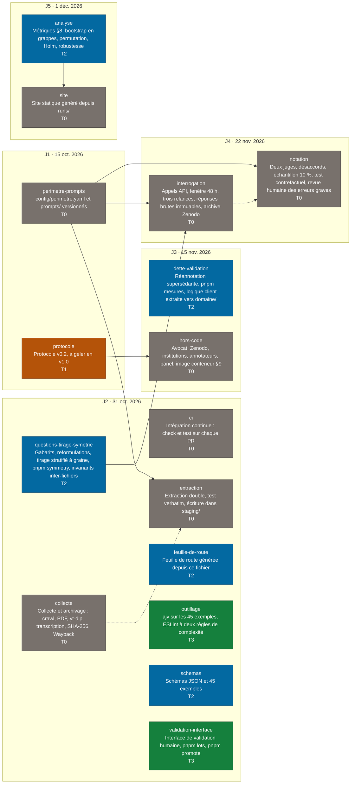

# Feuille de route — Banc d'essai 2027

> Fichier généré par `pnpm feuille-de-route` depuis `docs/feuille-de-route.json`. Ne pas éditer à la main. Mis à jour le 2026-09-20.

## Décisions en attente

Aucune décision en attente.

## Décisions tranchées

### D1 — Brancher une intégration continue GitHub Actions qui exécute `pnpm check` et `pnpm test` sur chaque PR ?

**Décision du 2026-09-20 :** GitHub Actions sur chaque PR : `pnpm check` et `pnpm test`, un seul fichier de workflow, aucune dépendance npm. C'est la seule preuve publique que les tests bloquants du §5 le sont réellement.

### D2 — Quelles dépendances autoriser pour la collecte et l'archivage (lot collecte) ?

**Décision du 2026-09-20 :** yt-dlp, faster-whisper en local, pymupdf et appel HTTP direct à l'API Wayback. Tout tourne sur la machine, aucune clé, transcription rejouable hors ligne par un tiers.

### D3 — Quels SDK d'API autoriser pour l'extraction, l'interrogation et la notation ?

**Décision du 2026-09-20 :** SDK officiels, un par éditeur, versions épinglées. La réponse brute stockée reste le corps HTTP tel que reçu, jamais l'objet du SDK (règle 7).

### D4 — Comment offrir le formulaire public de contestation (§4, droit de réponse) sur un site statique sans traceur ?

**Décision du 2026-09-20 :** Adresse mail dédiée seule pour la v1.0, phrase du §4 ajustée avant gel — révision de texte, pas amendement. Un service de formulaire pourra s'ajouter par amendement quand le volume le justifiera.

### D5 — Quelle est la liste nominative des outils et des candidats du premier run, et où vit-elle ?

**Décision du 2026-09-20 :** L'auteur applique les règles du §3 à la date du jour, archive les preuves d'inclusion et écrit config/perimetre.yaml, avec révision au gel du 15 octobre. Les lots dépendants démarrent sur un périmètre provisoire dès que le format est fixé.

### D6 — Six précisions du §8 remontées par le lot analyse, à écrire dans le protocole avant gel.

**Décision du 2026-09-20 :** Option 1 sur les six points : tronquées incluses dans les métriques primaires plus un quatrième recalcul de robustesse « hors tronquées » ; texte du dénominateur gardé et premisse_fausse interdite sur un item P dès l'engendrement ; Holm retiré de la famille des effets de condition, intervalles et qualificatif seuls publiés ; trois paires pour la famille des formulations ; exactitude globale dans la permutation ; comparateurs alignés sur les assistants.

### D7 — Sept conventions du tirage que le protocole n'écrit pas, retenues au plus restrictif par le lot questions.

**Décision du 2026-09-20 :** Option 1 sur les sept points : item arbitré tirable si la dernière décision du panel vaut maintien ou correction ; Q-ORI sur un item O résolue par l'état en vigueur ; ni Q-FER ni Q-NEG pour une position conditionnelle ; quota par strate fixé dans config/perimetre.yaml ; budget de reprise 80 % étendu aux Q-ATT, stratifiées par thème ; date civile comparée à date_gel à minuit UTC ; gabarits déplacés vers prompts/gabarits-1.0.0.json.

### D8 — Trois points que le §4 ne tranche pas, rencontrés en implémentant la réannotation et le registre des mesures.

**Décision du 2026-09-20 :** Option 1 sur les trois points : héritage des annotateurs gardé, une autre paire supposerait un amendement au §4 disant quel kappa compte ; clé du registre élargie seulement si le §4 ouvre un jour la correction d'autre chose que le thème ; conventions d'identifiant de réannotation et de date par défaut entérinées dans schema/README.md.

## Arbre

Légende : couleur par niveau de preuve — T0 gris, T1 ambre, T2 bleu, T3 vert, T4 bleu foncé ; une décision en attente est un hexagone rouge. Arête pleine (`-->`) = dépendance bloquante ; arête pointillée (`-.->`) = dépendance informative seulement.

## Lots

| Lot | Titre | Jalon | Niveau | État | Agent | Taille | Temps auteur (h) | Dépend de |
| --- | --- | --- | --- | --- | --- | --- | --- | --- |
| perimetre-prompts | config/perimetre.yaml et prompts/ versionnés | J1 | T0 | débloqué | auteur avec fable | S | 5 | — |
| protocole | Protocole v0.2, à geler en v1.0 | J1 | T1 | débloqué | auteur | S | 4 | — |
| ci | Intégration continue : check et test sur chaque PR | J2 | T0 | débloqué | sonnet | S | 0.25 | — |
| collecte | Collecte et archivage : crawl, PDF, yt-dlp, transcription, SHA-256, Wayback | J2 | T0 | débloqué | sonnet | L | 1 | — |
| extraction | Extraction double, test verbatim, écriture dans staging/ | J2 | T0 | bloqué par perimetre-prompts | opus | L | 1 | collecte (informe), perimetre-prompts |
| feuille-de-route | Feuille de route générée depuis ce fichier | J2 | T2 | débloqué | sonnet | S | 0.5 | — |
| outillage | ajv sur les 45 exemples, ESLint à deux règles de complexité | J2 | T3 | atteint | sonnet puis opus | M | 0.5 | — |
| questions-tirage-symetrie | Gabarits, reformulations, tirage stratifié à graine, pnpm symmetry, invariants inter-fichiers | J2 | T2 | débloqué | opus | L | 2 | — |
| schemas | Schémas JSON et 45 exemples | J2 | T2 | débloqué | fait | S | 0 | — |
| validation-interface | Interface de validation humaine, pnpm lots, pnpm promote | J2 | T3 | atteint | fait | L | 0 | — |
| dette-validation | Réannotation supersédante, pnpm mesures, logique client extraite vers domaine/ | J3 | T2 | débloqué | opus pour promote, sonnet pour le reste | M | 1 | — |
| hors-code | Avocat, Zenodo, institutions, annotateurs, panel, image conteneur §9 | J3 | T0 | bloqué par protocole | auteur | L | 24 | protocole |
| interrogation | Appels API, fenêtre 48 h, trois relances, réponses brutes immuables, archive Zenodo | J4 | T0 | bloqué par perimetre-prompts, questions-tirage-symetrie | opus | M | 1 | perimetre-prompts, questions-tirage-symetrie |
| notation | Deux juges, désaccords, échantillon 10 %, test contrefactuel, revue humaine des erreurs graves | J4 | T0 | bloqué par perimetre-prompts | opus | L | 2 | interrogation (informe), perimetre-prompts |
| analyse | Métriques §8, bootstrap en grappes, permutation, Holm, robustesse | J5 | T2 | débloqué | opus | L | 1 | — |
| site | Site statique généré depuis runs/ | J5 | T0 | bloqué par analyse | sonnet | M | 2 | analyse |

## Jalons

| Jalon | Date | Titre | Critère |
| --- | --- | --- | --- |
| J1 | 2026-10-15 | Protocole v1.0 gelé, relu par un avocat, déposé sur Zenodo, transmis aux institutions | Empreinte et DOI publiés ; liste nominative des outils et des candidats du premier run publiée |
| J2 | 2026-10-31 | Schéma, interface de validation, collecte et archivage en production | 100 items T1 archivés et extraits ; test verbatim et tests de symétrie verts en intégration continue |
| J3 | 2026-11-15 | Annotateurs formés ; 200 items vérifiés ; panel constitué ou faiblesse déclarée | Kappa ≥ 0,80 sur les deux derniers lots |
| J4 | 2026-11-22 | Run pilote complet ; jeu d'or de 300 réponses | Kappa juge-humain ≥ 0,75 ; taux de changement contrefactuel ≤ 3 % |
| J5 | 2026-12-01 | Premier run public mensuel | Tous les critères précédents ; au moins 8 candidats au-dessus du seuil de couverture |

### J1

- perimetre-prompts (T0)
- protocole (T1)

### J2

- ci (T0)
- collecte (T0)
- extraction (T0)
- feuille-de-route (T2)
- outillage (T3)
- questions-tirage-symetrie (T2)
- schemas (T2)
- validation-interface (T3)

### J3

- dette-validation (T2)
- hors-code (T0)

### J4

- interrogation (T0)
- notation (T0)

### J5

- analyse (T2)
- site (T0)

## Échelle de preuve

| Niveau | Définition |
| --- | --- |
| T0 | absent : rien n'existe |
| T1 | écrit, sans vérification automatique |
| T2 | testé unitairement, cas limites couverts |
| T3 | testé de bout en bout sur fixtures |
| T4 | exercé sur données réelles |

## Anomalies relevées

- README.md est encodé en UTF-16 avec BOM et ne contient qu'un titre.
- CLAUDE.md promet cinq commandes absentes de package.json : symmetry, run:dry, run:live, analyze, build:site.
- L'annexe A du protocole montre l'identifiant 2027-LEP-FISC-0012, contredit par la convention d'identifiants opaques de schema/README.md.
- Le suivi du taux de « non évaluable » par annotateur était donné pour manquant par docs/DETTE.md alors qu'il était implémenté depuis le 2026-09-17 : entrée corrigée le 2026-09-19.
