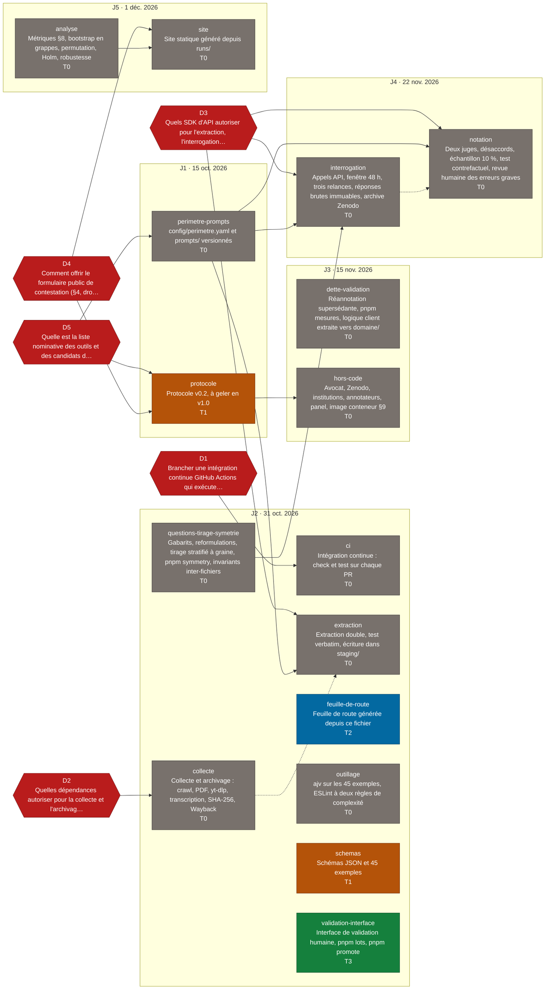

# Feuille de route — Banc d'essai 2027

> Fichier généré par `pnpm feuille-de-route` depuis `docs/feuille-de-route.json`. Ne pas éditer à la main. Mis à jour le 2026-09-18.

## Décisions en attente

### D1 — Brancher une intégration continue GitHub Actions qui exécute `pnpm check` et `pnpm test` sur chaque PR ?

Aujourd'hui « testé » est une déclaration : rien ne rejoue les tests hors de la machine de l'auteur. GitHub Actions est un service tiers, donc une décision de l'auteur (CLAUDE.md, arrêt obligatoire).

Options :

1. Oui, GitHub Actions, un fichier de quatre lignes, aucune dépendance npm.
2. Non, on s'en remet à la discipline de session ; le risque est un test rouge fusionné sans que personne ne le voie.

**Recommandation :** Oui. Coût unique négligeable, et c'est la seule preuve publique que les tests bloquants du §5 sont réellement bloquants.

Lots portant cette décision : ci

### D2 — Quelles dépendances autoriser pour la collecte et l'archivage (lot collecte) ?

La collecte doit produire les artefacts de docs/CONTRATS.md : texte canonique NFC, transcription WebVTT, copie locale avec SHA-256, sauvegarde Wayback. Aucune bibliothèque de la stdlib Python ou Node ne télécharge une vidéo, ne transcrit de l'audio ni n'extrait proprement le texte d'un PDF.

Options :

1. yt-dlp + faster-whisper en local + pymupdf + appel HTTP direct à l'API Wayback : tout tourne sur la machine, aucune clé, transcription reproductible.
2. yt-dlp + API de transcription hébergée + pymupdf : plus rapide, mais un service tiers de plus et une transcription non reproductible hors ligne.
3. Pas de vidéo en v1.0 : sources T1 seulement, ce qui supprime yt-dlp et la transcription mais exclut les sources T2 que le §4 prévoit.

**Recommandation :** Option 1. Tout local, tout reproductible, quatre dépendances justifiables une par une dans le brief.

Lots portant cette décision : collecte

### D3 — Quels SDK d'API autoriser pour l'extraction, l'interrogation et la notation ?

Trois lots appellent des modèles : l'extraction double (deux familles), l'interrogation des outils du périmètre, les deux juges. Chaque SDK est une dépendance et un appel réseau nouveau (CLAUDE.md, arrêt obligatoire).

Options :

1. SDK officiels, un par éditeur, versions épinglées : typage fourni, retries maison, surface d'audit = nombre d'éditeurs.
2. Appels HTTP directs sans SDK : zéro dépendance, mais chaque format de réponse brute réécrit à la main, source d'erreurs sur la règle 7.

**Recommandation :** Option 1, avec la liste nominative fixée par le lot périmètre. La réponse brute stockée est le corps HTTP tel que reçu, pas l'objet du SDK.

Lots portant cette décision : extraction, interrogation, notation

### D4 — Comment offrir le formulaire public de contestation (§4, droit de réponse) sur un site statique sans traceur ?

Le §4 exige « un formulaire public et une adresse dédiée ». La règle 1 interdit tout runtime, le §10 interdit tout traceur. Un formulaire suppose un service qui reçoit les envois.

Options :

1. Adresse mail dédiée seule pour la v1.0 : le §4 dit « formulaire public ET adresse », donc une révision de texte avant gel, pas un amendement.
2. Service de formulaire tiers déclaré dans le protocole, avec son traitement de données personnelles à documenter (§10, RGPD).
3. Formulaire via GitHub Issues public : gratuit, tracé, mais exige un compte GitHub au contestataire.

**Recommandation :** Option 1 pour la v1.0, texte du §4 ajusté avant gel. Un service de formulaire peut s'ajouter par amendement quand le volume le justifie.

Lots portant cette décision : protocole, site

### D5 — Quelle est la liste nominative des outils et des candidats du premier run, et où vit-elle ?

Le §3 fixe des règles d'inclusion mais la liste nominative doit être publiée au gel (J1). Elle alimente config/perimetre.yaml, que seul l'auteur écrit. Elle bloque l'extraction, l'interrogation et la notation, qui ont besoin de savoir quels éditeurs appeler.

Options :

1. L'auteur applique les règles du §3 à la date du jour, archive les preuves d'inclusion (deux sondages, classements de stores) et écrit config/perimetre.yaml.
2. Attendre plus près du gel pour une liste plus fraîche, au prix de bloquer trois lots pendant ce temps.

**Recommandation :** Option 1 maintenant, avec révision au gel : les lots dépendants peuvent être développés sur un périmètre provisoire tant que le format est fixé.

Lots portant cette décision : perimetre-prompts, protocole

## Décisions tranchées

Aucune décision tranchée.

## Arbre

Légende : couleur par niveau de preuve — T0 gris, T1 ambre, T2 bleu, T3 vert, T4 bleu foncé ; une décision en attente est un hexagone rouge. Arête pleine (`-->`) = dépendance bloquante ; arête pointillée (`-.->`) = dépendance informative seulement.

## Lots

| Lot | Titre | Jalon | Niveau | État | Agent | Taille | Temps auteur (h) | Dépend de |
| --- | --- | --- | --- | --- | --- | --- | --- | --- |
| perimetre-prompts | config/perimetre.yaml et prompts/ versionnés | J1 | T0 | bloqué par D5 | auteur avec fable | S | 5 | — |
| protocole | Protocole v0.2, à geler en v1.0 | J1 | T1 | bloqué par D4, D5 | auteur | S | 4 | — |
| ci | Intégration continue : check et test sur chaque PR | J2 | T0 | bloqué par D1 | sonnet | S | 0.25 | — |
| collecte | Collecte et archivage : crawl, PDF, yt-dlp, transcription, SHA-256, Wayback | J2 | T0 | bloqué par D2 | sonnet | L | 1 | — |
| extraction | Extraction double, test verbatim, écriture dans staging/ | J2 | T0 | bloqué par D3, perimetre-prompts | opus | L | 1 | collecte (informe), perimetre-prompts |
| feuille-de-route | Feuille de route générée depuis ce fichier | J2 | T2 | débloqué | sonnet | S | 0.5 | — |
| outillage | ajv sur les 45 exemples, ESLint à deux règles de complexité | J2 | T0 | débloqué | sonnet puis opus | M | 0.5 | — |
| questions-tirage-symetrie | Gabarits, reformulations, tirage stratifié à graine, pnpm symmetry, invariants inter-fichiers | J2 | T0 | débloqué | opus | L | 2 | — |
| schemas | Schémas JSON et 45 exemples | J2 | T1 | débloqué | fait | S | 0 | — |
| validation-interface | Interface de validation humaine, pnpm lots, pnpm promote | J2 | T3 | atteint | fait | L | 0 | — |
| dette-validation | Réannotation supersédante, pnpm mesures, logique client extraite vers domaine/ | J3 | T0 | débloqué | opus pour promote, sonnet pour le reste | M | 1 | — |
| hors-code | Avocat, Zenodo, institutions, annotateurs, panel, image conteneur §9 | J3 | T0 | bloqué par protocole | auteur | L | 24 | protocole |
| interrogation | Appels API, fenêtre 48 h, trois relances, réponses brutes immuables, archive Zenodo | J4 | T0 | bloqué par D3, perimetre-prompts, questions-tirage-symetrie | opus | M | 1 | perimetre-prompts, questions-tirage-symetrie |
| notation | Deux juges, désaccords, échantillon 10 %, test contrefactuel, revue humaine des erreurs graves | J4 | T0 | bloqué par D3, perimetre-prompts | opus | L | 2 | interrogation (informe), perimetre-prompts |
| analyse | Métriques §8, bootstrap en grappes, permutation, Holm, robustesse | J5 | T0 | débloqué | opus | L | 1 | — |
| site | Site statique généré depuis runs/ | J5 | T0 | bloqué par D4, analyse | sonnet | M | 2 | analyse |

## Jalons

| Jalon | Date | Titre | Critère |
| --- | --- | --- | --- |
| J1 | 2026-10-15 | Protocole v1.0 gelé, relu par un avocat, déposé sur Zenodo, transmis aux institutions | Empreinte et DOI publiés ; liste nominative des outils et des candidats du premier run publiée |
| J2 | 2026-10-31 | Schéma, interface de validation, collecte et archivage en production | 100 items T1 archivés et extraits ; test verbatim et tests de symétrie verts en intégration continue |
| J3 | 2026-11-15 | Annotateurs formés ; 200 items vérifiés ; panel constitué ou faiblesse déclarée | Kappa ≥ 0,80 sur les deux derniers lots |
| J4 | 2026-11-22 | Run pilote complet ; jeu d'or de 300 réponses | Kappa juge-humain ≥ 0,75 ; taux de changement contrefactuel ≤ 3 % |
| J5 | 2026-12-01 | Premier run public mensuel | Tous les critères précédents ; au moins 8 candidats au-dessus du seuil de couverture |

### J1

- perimetre-prompts (T0)
- protocole (T1)

### J2

- ci (T0)
- collecte (T0)
- extraction (T0)
- feuille-de-route (T2)
- outillage (T0)
- questions-tirage-symetrie (T0)
- schemas (T1)
- validation-interface (T3)

### J3

- dette-validation (T0)
- hors-code (T0)

### J4

- interrogation (T0)
- notation (T0)

### J5

- analyse (T0)
- site (T0)

## Échelle de preuve

| Niveau | Définition |
| --- | --- |
| T0 | absent : rien n'existe |
| T1 | écrit, sans vérification automatique |
| T2 | testé unitairement, cas limites couverts |
| T3 | testé de bout en bout sur fixtures |
| T4 | exercé sur données réelles |

## Anomalies relevées

- README.md est encodé en UTF-16 avec BOM et ne contient qu'un titre.
- CLAUDE.md promet cinq commandes absentes de package.json : symmetry, run:dry, run:live, analyze, build:site.
- L'annexe A du protocole montre l'identifiant 2027-LEP-FISC-0012, contredit par la convention d'identifiants opaques de schema/README.md.
